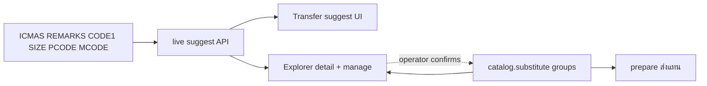

# Product substitute (สินค้าทดแทน) — master plan

## Glossary (locked)

| Operator says | Means here | Not |
|---------------|------------|-----|
| qtylo -1 / L-1 / ไม่สั่งซ้ำ / ไม่สต็อก | `ICMAS.QTYMIN < 0` (usually `-1`), **per branch** | Out of stock (`QTYOH2 = 0`) |
| **แนะนำทดแทน / suggestion** | Live ICMAS signals (REMARKS, CODE1+SIZE, PCODE, MCODE) — **hint only** | Confirmed catalog / ส่งแทน |
| สินค้าทดแทน / catalog / กลุ่มทดแทน | Operator-**confirmed** mutual peer SKUs in `catalog.substitute_*` | Auto-seed from Phase 0 |
| ส่งแทน | Prepare ships a **catalog peer** BCODE against the original request line | Shipping a live-only suggestion without confirm |

## Design

| Layer | Role | Gates ส่งแทน? |
|-------|------|----------------|
| **Live suggestion** | `src/substitutes/suggest.py` — REMARKS (directed), CODE1+SIZE exact, PCODE, MCODE | **No** |
| **Catalog** | Mutual groups operators create in Explorer | **Yes** |



### Live suggestion signals

1. **remarks** — directed “ใช้รหัส … แทน” (no union-find / mutual merge)
2. **code_size** — same `CODE1` + exact filled `SIZE1/2/3` (Explorer รหัส+ขนาด)
3. **pcode** — same clean OEM / เบอร์แท้
4. **mcode** — same clean factory / เบอร์โรงงาน

Merge by BCODE; priority `remarks` > `code_size` > `pcode` > `mcode`.

### Catalog tables

```text
catalog.substitute_groups / catalog.substitute_members
UNIQUE(bcode) — one group per SKU in v1
```

No Phase 0 bulk seed into catalog. Catalog grows only via intentional create / promote from suggestion.

## Code anchors

- Live suggest: `src/substitutes/suggest.py`, `peers.py` (`attach_live_suggestions`)
- Catalog: `src/substitutes/db.py`, `ship_as.py`
- API: `GET /parts9/api/substitutes/suggest/{bcode}`, CRUD under `/parts9/api/substitutes/...`
- Transfer: `suggest_transfer_skus` + `enrich_transfer_lines` attach `suggestions[]`; UI `fmtSubsHint`
- Explorer: product detail panels + `/parts9/substitutes` manage page

## Non-goals

- Auto-import Phase 0 CSV into catalog
- Relaxing ส่งแทน to accept live-only peers
- Fuzzy PCODE/MCODE match
- Writing substitutes back into `ICMAS.REMARKS`
